# 젠킨스(Jenkins) 로 자동 배포하기


 
## 젠킨스(Jenkins) 란?
 - 오픈소스 지속적 통합 CI(continuous intergration) 툴로 JAVA로 만들어 졌음
 - csv, svn, git 등의 소스 툴을 지원하고 ant와 maven등의 빌드 툴을 지원함 
 - 배포 파일은 Java Web Archive(.war) 형태로 제공
 - 다양한 플러그인을 지원함
 
---

## 지속적인 통합(CI, Continuous Integration)
 - 팀의 구성원들이 작업한 내용을 정기적으로 통합하는 것
 - 지속적으로 퀄리티 컨트롤을 적용하는 프로세스를 실행하는 것
 - 작은 단위의 작업, 빈번한 적용. 지속적인 통합은 모든 개발을 완료한 뒤에 ***퀄리티 컨트롤(QC)*** 을 적용하는 고전적인 방법을 대체하는 방법
 - 소프트웨어의 질적 향상과 소프트웨어를 배포하는데 걸리는 시간을 줄이는데 초점이 맞추어져 있음

### 퀄리티 컨트롤(QC, Quality Control)
 - 엔티티 생산에 관련된 모든 품질 요인을 검토하는 과정

---

## 젠킨스(Jenkins) 기능
 - 소스 코드 체크아웃
 - 분산 빌드
 - 빌드 및 테스트 자동화
 - 테스트 보고서 작성
 - Groovy script 를 이용한 Job 스케줄링 기능
 - 커맨드라인 인터페이스 제공
 - 윈도우커맨드 스케줄링 실행 가능
 - 실행결과를 통보
 - 결과물을 저장
 - 자동 배포

---

## 젠킨스(Jenkins) 설치

 - ### homebrew 를 이용한 스퀴드 설치
> brew install jenkins 

 - ### yum 을 이용한 스퀴드 설치
> wget -O /etc/yum.repos.d/jenkins.repo http://pkg.jenkins-ci.org/redhat-stable/jenkins.repo
> 
> rpm --import https://jenkins-ci.org/redhat/jenkins-ci.org.key
> 
> yum install jenkins

---

## 젠킨스(Jenkins) 시작/종료

 - ### 설치 후 <http://127.0.0.1:8080/> 자동실행됨

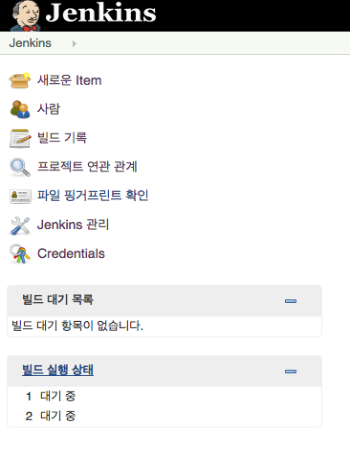
 - ### 시작 명령어
> launchctl load homebrew.mxcl.jenkins.plist 
>
> service jenkins start

 - ### 종료 명령어
> launchctl unload homebrew.mxcl.jenkins.plist
>
> service jenkins stop


---

## 젠킨스(Jenkins) 관리 설정
 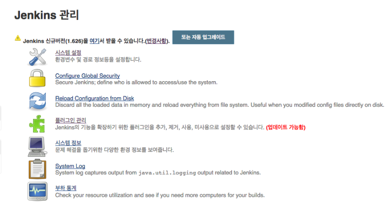
 
---
 
### 플러그인 설정

 - 깃헙 관련 플러그인

```
git plugin
github plugin
```

 - 그루비 플러그인

```
Groovy
```
 - 그래들 플러그인

````
Gradle plugin
```` 
 - 그레일즈 플로그인
 
````
Grails plugin
````

 - 배포 관련 플러그인
 
```
Deploy to container plugin
```

 - FTP 관련 플러그인
 
```
Publish Over FTP
```

---

### 시스템 설정

- JDK 설정
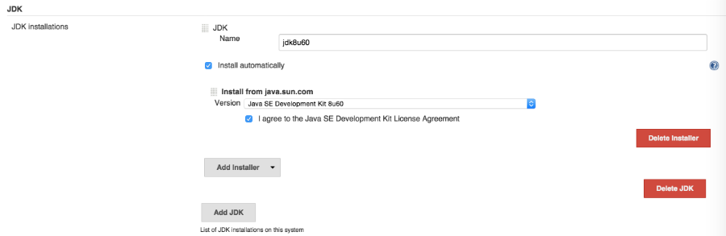
- Maven 설정
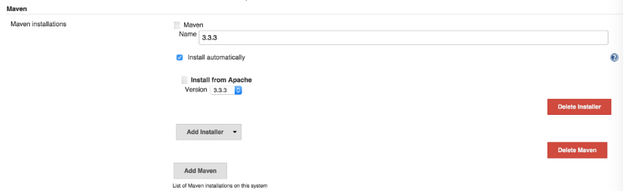
- Groovy 설정

- Gradle 설정

- Grails 설정

- Email 알림 설정
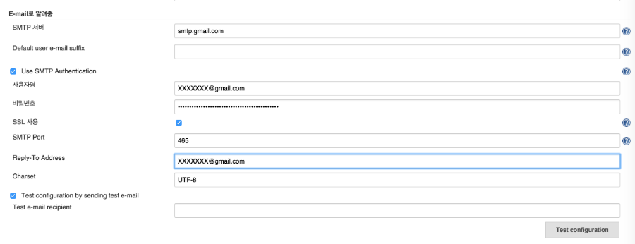
	- gmail 에서 SMTP service 제공
	- gmail 에서 '로그인 및 보안' 탭에서 보안수준 설정	
		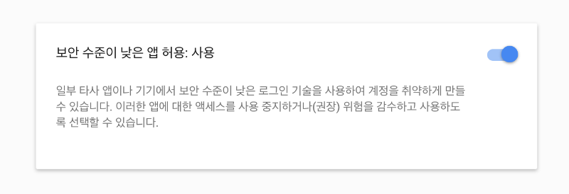
- FTP 서버 설정
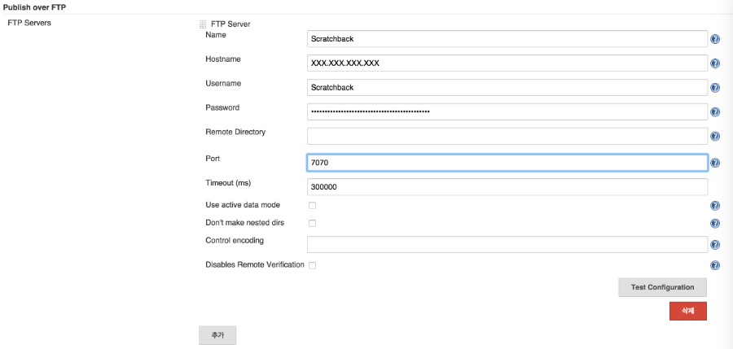
 
---

## Maven 프로젝트 빌드 설정
 1. 프로젝트 생성 : item 이름 설정후, ***'Maven project'*** 클릭
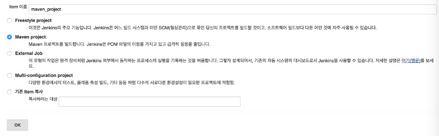
 2. 프로젝트 설명 : 프로젝트 설명과 '오래된 빌드 삭제' 여부 선택
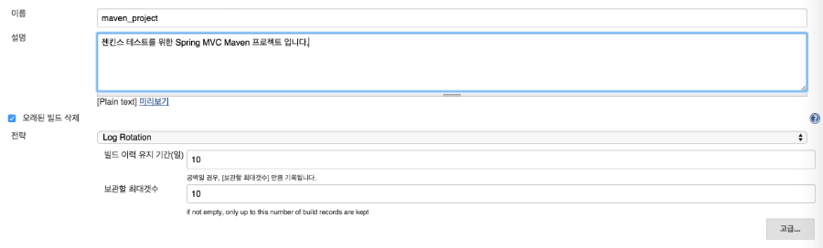
 3. 소스 코드 관리 : Git 소스 관리 프로젝트인 경우
  
 4. 빌드 설정 : 매 30분마다 확인 후 변경 내용이 있으면 빌드
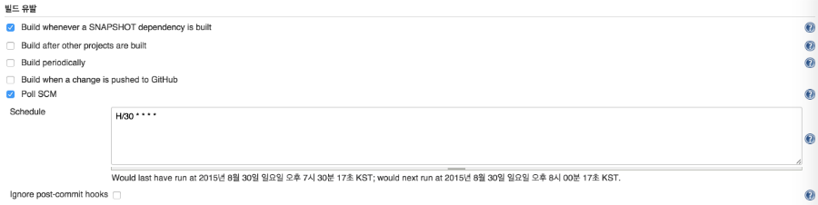
 5. 빌드 전에 실행할 내용 : 샘플 스크립트 파일을 실행

 6. 빌드 : pom.xml 의 경로 설정
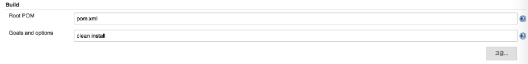
 7. 빌드 후에 실행할 내용 : 그루비 문법 테스트
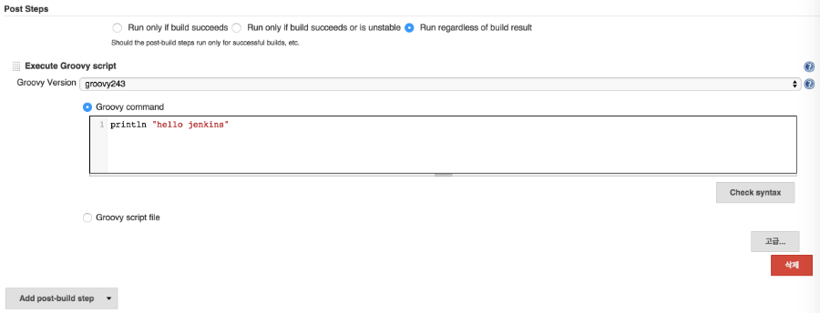
 8. Email 알림 설정
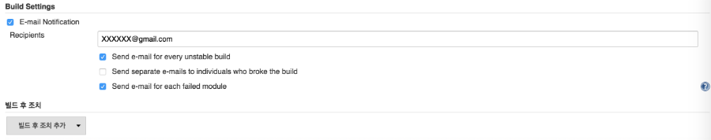 

---

### Gradle 프로젝트 빌드
#### 프로젝트 생성시 'FreeStyle Project' 선택 후 빌드 설정을 해줌
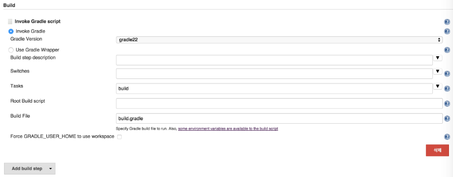

---

### Grails 프로젝트 빌드
#### 프로젝트 생성시 'FreeStyle Project' 선택 후 빌드 설정을 해줌


---

## 프로젝트 빌드
 - #### 빌드하기 : 'Build Now' 를 클릭

 - #### 빌드결과
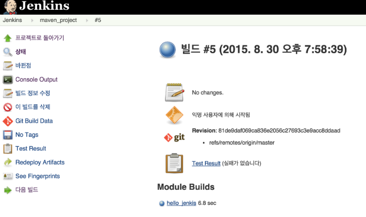

---

## 추가 기능

###깃헙 에서 푸시 하면, 자동 빌드 하기
1. 빌드유발에서 'Build when a change is pushed to GitHub' 체크박스 선택
2. Github 프로젝트에서 'Settings' 클릭
3. 'Webhooks & Services' 탭 클릭
4. Add Service 에서 'Jenkins (GitHub plugin)' 클릭
5. ***Jenkins hook url*** 을 설정 ***(127.0.0.1:8080 또는 localhost:8080 은 안됨)***
6. 빌드

 

### FTP 서버로 war 파일 전송하기
 1. 젠킨스 관리에서 플러그인(Publish Over FTP) 및 시스템 설정 후
 2. 등록한 FTP 서버 선택
 3. war 파일의 경로 설정
 4. 빌드
 
 
 		

### Tomcat 서버에 war 파일 띄우기
```
<tomcat-users>
 	<role rolename="manager-script"/>
 	<role rolename="manager-gui"/>
 	<user username="admin" password="1234" roles="manager-gui, manager-script"/>
</tomcat-users>
```
 1. tomcat/conf 에서 ***tomcat-users.xml*** 파일에서 위의 내용 추가
 2. 젠킨스 관리에서 플러그인(Deploy to container plugin) 및 시스템 설정 후
 3. 톰캣서버 버젼 선택
 4. tomcat-users.xml 에 등록한 username, password 입력 후
 5. ***Tomcat URL 설정***
 6. 빌드
 
 

### 테스트 리포트 설정하기

```
<parent>
	<groupId>org.jenkins-ci.plugins</groupId>
	<artifactId>plugin</artifactId>
	<version>1.542</version>
</parent>
<repositories>
	<repository>
		<id>jenkins-releases</id>
		<url>http://repo.jenkins-ci.org/releases</url>
	</repository>
	<repository>
		<id>repo.jenkins-ci.org</id>
		<url>http://repo.jenkins-ci.org/public</url>
	</repository>
</repositories>
```
	
1. 프로젝트 pom.xml 위의 내용을 추가
2. 테스트케이스 작성 후
3. 빌드

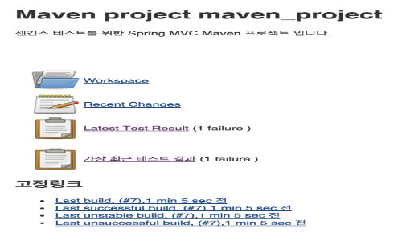

